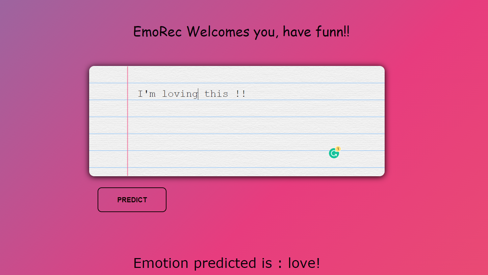

# EmoRec - An Intelligent Emotion Predictor 

This Project uses a natural language processing technique used to determine whether data is positive, negative or neutral. Sentiment analysis is often performed on textual data to help businesses monitor brand and product sentiment in customer feedback, and understand customer needs.

## Tech Stack:
* HTML
* CSS
* Python (Flask as Backend)

## Screen Shot of the WebApp:

